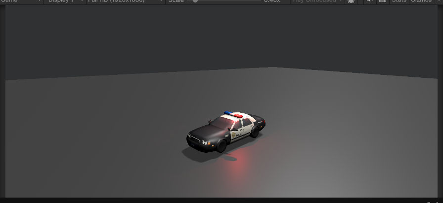

# Police Car Controller 🚓

Welcome to the **Police Car Controller** project! This Unity-based simulation allows you to control a police car with realistic headlights, sirens, and movement dynamics. It's an interactive and fun way to experience basic vehicle controls and light mechanics in Unity.

---

## 🚀 Features

1. **Drive the Police Car**:
   - Use the **arrow keys** to move the car forward, backward, and turn left or right.

2. **Control the Headlights**:
   - Press the **G key** to toggle the car's headlights on and off.

3. **Activate the Siren**:
   - Use the **Space key** to switch the siren on or off, including sound and light effects.

4. **Dynamic Siren Lights**:
   - The **siren lights** alternate automatically when activated, providing a realistic flashing effect.

---

## 🛠️ Technical Details

- **Unity Editor Version**: `6000.0.251f`
- **Programming Language**: C# (Unity Engine)

---

## 🎮 Controls

| **Action**                | **Key**            |
|---------------------------|--------------------|
| Move Forward/Backward     | Arrow Up/Down      |
| Turn Left/Right           | Arrow Left/Right   |
| Toggle Headlights         | G                  |
| Toggle Siren              | Space              |

---

## 🔧 Setup Instructions

1. Clone or download the project repository to your system.
2. Open the project in **Unity Editor (version 6000.0.251f or later)**.
3. Add your police car model and attach the required components:
   - Ensure the **CarController** script is attached to your car GameObject.
   - Assign the required lights and audio source in the script's Inspector fields.
4. Play the scene and enjoy controlling the police car!

---

## 📷 Screenshots

---

## 🤝 Contributions

Feel free to fork the repository and submit pull requests if you’d like to enhance the project or add new features! Suggestions and feedback are always welcome. 😊

---

## 📄 License

This project is for educational and non-commercial use only. If you'd like to use this for other purposes, please contact the author.

---

### 🚓 Drive with responsibility (and fun)! 🚦
